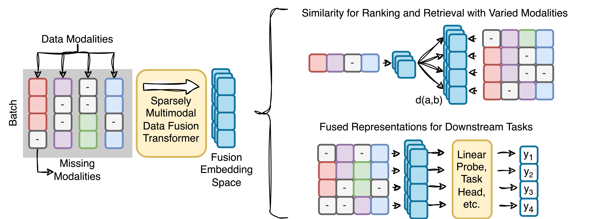

# Code for Sparsely Multimodal Data Fusion

This repository is the official implementation of Sparsely Multimodal Data Fusion




# Requirements

To install requirements:

```angular2html
pip install -r requirements.txt
```

This repository makes heavy use of Huggingface Accelerator and Datasets libraries for managing training and data and WandB for collecting performance metrics. A WandB account name needs to be provided in config files under the setting `wandb_account_name` in order to collect train and eval metrics.

# Training
To train the model, choose a configuration file from the configs directory and run

```angular2html
accelerate launch train_accel_gpu.py <config_file_path>
```

Preprocessed datasets are available to download with the following links
* [TCGA Dataset (122MB)](https://mca-paper.s3.us-west-2.amazonaws.com/tcga_dataset.tar.gz)
* [CMU Dataset (38.2GB)](https://mca-paper.s3.us-west-2.amazonaws.com/cmu.dataset.tar.gz)

# Evaluation
To evaluate the model, run an inference using pretrained model weights, then train a linear probe to fit a target property.

To run a batch inference:

```angular2html
accelerate launch infer_accel_gpu.py <config_file_path>
```

To train a linear probe or MLP using the embeddings generated by inference:

```angular2html
accelerate launch lp_accel_gpu.py <config_file_path>
```

# Pre-trained Models

The full set of model checkpoints have been made available for models trained using the described dataset modality dropout of 0.4 for the purpose of reproducing experiments.

| Dataset | Model Type | Link                                                                                |
|---------|-----|-------------------------------------------------------------------------------------|
| TCGA    | MCA | [link (2GB)](https://mca-paper.s3.us-west-2.amazonaws.com/training_output_01_06_08_03_2024_2.tar.gz) |
| TCGA    | MMA | [link (2GB)](https://mca-paper.s3.us-west-2.amazonaws.com/training_output_01_03_08_03_2024_1.tar.gz) |
| CMU     | MCA | [link (2GB)](https://mca-paper.s3.us-west-2.amazonaws.com/training_output_19_23_06_03_2024_3.tar.gz)        |
| CMU     | MMA | [link (2GB)](https://mca-paper.s3.us-west-2.amazonaws.com/training_output_19_23_06_03_2024_9.tar.gz)        |

# Training with Other Datasets for Multimodal Fusion Embeddings

## Dataset configurations
Data encoders are provided which can be configured to collate any combination of sequence, tabular, and pre-embedded modality tokens in `encoders.py`. The configuration for a given dataset is presented in the example yaml config files. An example configuration is shown below.

```angular2html
encoder_configs:
  COVAREP: {type: 'EmbeddedSequenceEncoder', input_size: 74, max_tokens: 1500}
  FACET: {type: 'EmbeddedSequenceEncoder', input_size: 35, max_tokens: 450}
  OpenFace: {type: 'EmbeddedSequenceEncoder', input_size: 713, max_tokens: 450}
  glove_vectors: {type: 'EmbeddedSequenceEncoder', input_size: 300, max_tokens: 50}
modality_config:
  COVAREP: {type: 'embedded_sequence', pad_len: 1500, data_col_name: "data", pad_token: -10000}
  FACET: {type: 'embedded_sequence', pad_len: 450,  data_col_name: "data", pad_token: -10000}
  OpenFace: {type: 'embedded_sequence', pad_len: 450, data_col_name: "data", pad_token: -10000}
  glove_vectors: {type: 'embedded_sequence', pad_len: 50, data_col_name: "data", pad_token: -10000}
```

Multimodal data is received as a dictionary of tensors with keys given by the names under `encoder_configs` and the type of data encoder is given by the `type` field. The encoder types are: `SequenceEncoder, TabularEncoder, SparseTabularEncoder, PatchEncoder, EmbeddedSequenceEncoder`.

The `modality_config` filed defines the modality collator type. Available types are: `sequence`, `embedded_sequence`, `matrix`. Tabular encoders use the `sequence` collator.

These configuration options define the number of modalities and encoding of the input data before the multimodal fusion transformer and can be adjusted for other multimodal datasets.

## Model configurations
Depending on the alignment in multimodal data and general transformer encoder hyperparameters, you may change model configuration parameters. See `utils/config.py` for an extensive list of model hyperparameters.

# Contributing

Anonymized


## NeurIPS 2024 submission

