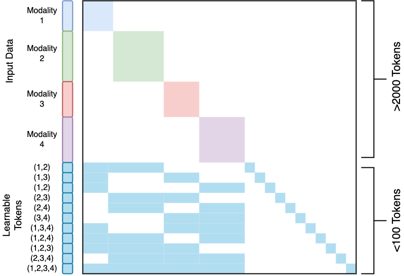
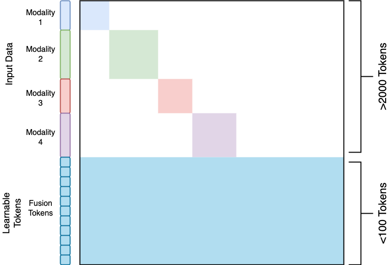

# Code for Sparse Multimodal Fusion with Modal Channel

This repository is the official implementation of Sparse Multimodal Fusion with Modal Channel Attention






# Requirements

To install requirements:

```angular2html
pip install -r requirements.txt
```

# Training

# Evaluation

# Pre-trained Models

# Results

# Contributing


## NeurIPS 2024 submission

